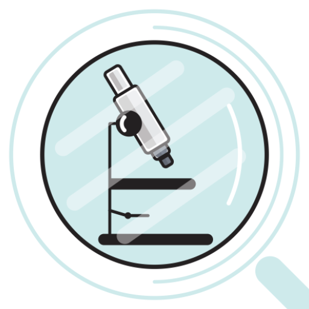
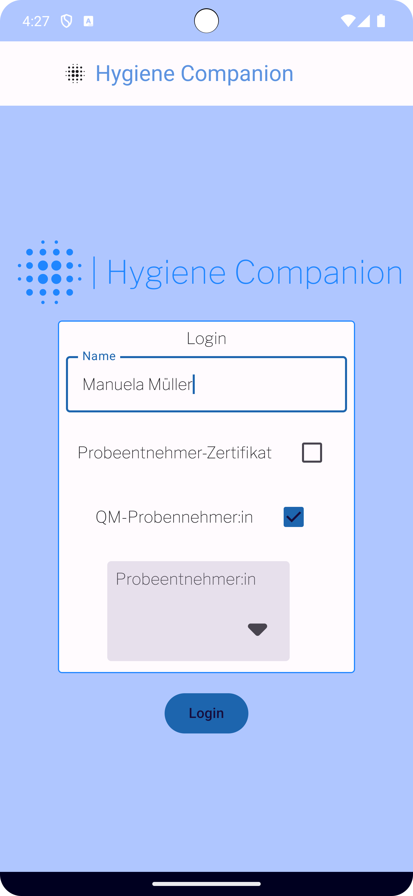
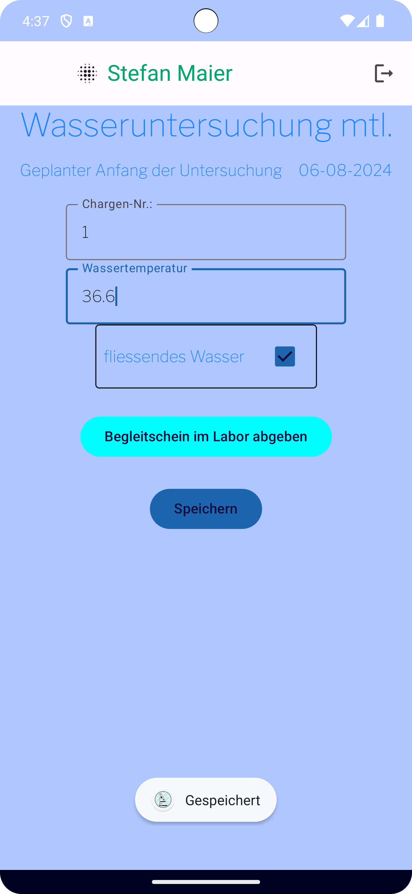

# Hygiene Lab Companion

## Overview

An Android prototype app for supporting laboratory workers at exchanging sampling data.
Bachelor Thesis project. 

## Technologies

_Android_ | _Jetpack Compose_ | _Firebase App Distribution_ | _FireStore_ | _adaptive layouts_

## Images

<div style="display: 'flex'">
   
   
</div>

## Usage

### Prerequisites

- Android Studio (See: https://developer.android.com/studio/install)
- Firebase App Project (See: https://firebase.google.com/docs/firestore/quickstart#android)

### Installation

1. Clone this repository:

   ```bash
   git clone https://github.com/chris-prenissl/hygiene-lab-companion.git
   ```

2. Copy your ```google-services.json``` file into the _composeApp_ directory

3. Change the applicationId in the _composeApp_ ```build.gradle.kts``` to the registered name in Firebase.

4. You should now be able to run the app.

# License

The app icon is designed by [Freepik](http://www.freepik.com/).

This project is licensed under the MIT License - see the [LICENSE](LICENSE.md) file for details.
